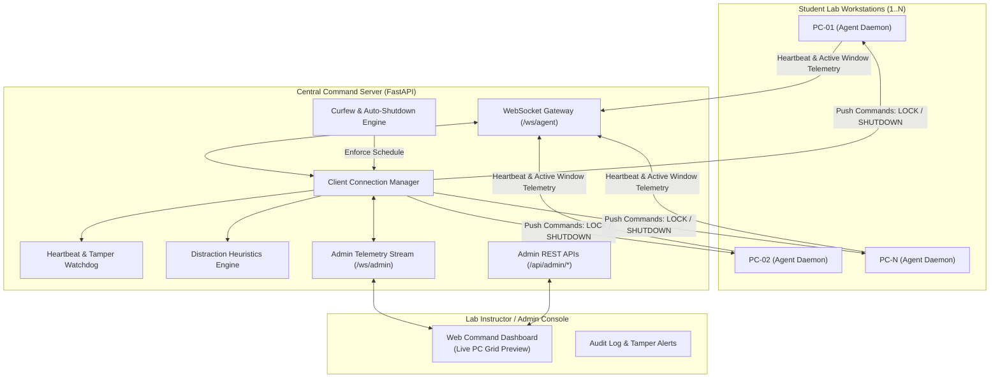

# Smart Lab Command Center — System Specification (spec.md)

> **Project Name**: Smart Lab Command Center (`02-smart-lab-command-center`)  
> **Target Audience**: As-Sunnah Foundation Computer Labs & Modern Educational Institutions  
> **Standard Compliance**: SBMC AGENTS.md Foundation Rules (Python 3.12+, FastAPI, WebSockets, Strict Typing, Pydantic Schema Validation)  
> **Status**: Approved Scaffolding & Architecture Blueprint  

---

## 1. Executive Summary & Context

Modern educational computer laboratories—such as those operated by the **As-Sunnah Foundation** and vocational technical training centers—require balanced, disciplined, and secure environments. Computer labs face distinct operational challenges:
1. **Focus & Ethical Computing**: Students frequently get sidetracked by short-form video addictions (Facebook Reels, YouTube Shorts, TikTok, gaming) during instructional lab hours.
2. **Resource Conservation & Lab Curfew**: Labs must close cleanly on schedule. Leaving dozens of PCs running overnight wastes electricity and accelerates hardware wear. A strict **9:00 PM (21:00)** curfew with graceful lock and auto-shutdown prevents unauthorized after-hours usage.
3. **Anti-Tampering & Discipline**: Students often disconnect LAN cables, disable background task agents, or close monitoring tools to bypass lab rules. Real-time heartbeat detection immediately flags disconnections as potential tampering.
4. **Centralized Teacher/Admin Oversight**: A single lab instructor needs a real-time command dashboard showing all workstations at a glance with one-click broadcast actions (e.g., Lock Screen, Warning Message, Instant Lab Shutdown).

---

## 2. System Architecture

The Smart Lab Command Center is built on an event-driven, decoupled client-server architecture using lightweight WebSockets for bidirectional, low-latency communication over the local network.



### 2.1 Architectural Components
1. **Central Command Server (`server/`)**:
   - **FastAPI Core**: Exposes async WebSocket endpoints and REST management endpoints.
   - **Connection Manager (`server/manager.py`)**: Maintains thread-safe registries of active lab workstations, IP addresses, current users, hardware metrics, and telemetry histories.
   - **Tamper Watchdog**: Tracks client heartbeats. If a client goes silent for more than a threshold interval (default: 15s), an immediate `DISCONNECTED_TAMPERED` alert is triggered.
   - **Curfew & Shutdown Engine (`server/curfew.py`)**: Background scheduler monitoring local lab time. Automatically broadcasts warnings at 20:50, locks student screens at 21:00, and triggers graceful operating system shutdowns at 21:05 unless an admin override is active.
   - **Distraction Detector (`agent/detector.py` / `server/detector.py`)**: Inspects active window titles and running process names against blacklist keywords (e.g., `YouTube Shorts`, `Reels`, `TikTok`, `Steam`, `Torrent`).
2. **Lightweight Client Agent (`agent/client_agent.py`)**:
   - Zero-overhead Python daemon running in the background of each lab workstation.
   - Gathers system telemetry: Workstation ID, Student Name, IP Address, CPU/RAM utilization, Active Foreground Window Title, and Process Name.
   - Maintains continuous WebSocket session with Central Server.
   - Receives and executes authorized remote commands:
     - `LOCK`: Displays full-screen immutable curfew/disciplinary lock overlay.
     - `UNLOCK`: Restores normal desktop usage upon instructor authorization.
     - `MESSAGE`: Displays high-priority pop-up broadcast banner to the student.
     - `SHUTDOWN`: Initiates OS-level graceful system shutdown.
     - `KILL_PROCESS`: Terminates unauthorized process.
3. **Instructor Dashboard (`server/templates/` & Static UI)**:
   - Real-time interactive grid displaying all lab computers.
   - Live color badges (Online, Idle, Distracted/Reels, Tampered/Disconnected, Curfew Locked).
   - One-click master buttons: **"Emergency Lab Lock"**, **"Curfew Shutdown"**, **"Broadcast Message"**, **"Reset Overrides"**.

---

## 3. Core Functional Requirements

### 3.1 Live PC Grid & Workstation Telemetry
- **Grid Layout**: Displays workstations grouped by lab or row (e.g., `LAB-A-PC01` to `LAB-A-PC30`).
- **Telemetry Payload**: Every workstation reports state every 5 seconds:
  - Hostname, assigned IP, MAC/UUID.
  - Student identity / logged-in user.
  - Active foreground application and window title.
  - CPU usage (%) and Memory utilization (%).
  - Agent version and uptime.
- **Latency Target**: Telemetry updates reflected on instructor dashboard in `< 500ms`.

### 3.2 Active App & Reels / YouTube Distraction Detection
- **Detection Heuristics**:
  - Window title matching: `*Reels*`, `*Shorts*`, `*TikTok*`, `*YouTube*`, `*Facebook*`, `*Instagram*`.
  - Process matching: games, media players, streaming utilities.
  - Distinction between educational content and entertainment:
    - *Allowed*: `YouTube - Python Programming Tutorial`, `As-Sunnah Foundation Lecture`.
    - *Prohibited*: `YouTube Shorts`, `Funny Reels - Facebook`, `TikTok - Make Your Day`.
- **Action Triggers**:
  - Instructor Dashboard highlights workstation in amber/red alert ring.
  - Violation counter increments for student session.
  - Automated warning push: *"Educational lab rules in effect. Please return to your assigned learning material."*

### 3.3 Heartbeat Disconnect Alert & Tamper Protection
- **Failure Modes Handled**:
  1. Student kills agent process via Task Manager.
  2. Student unplugs Ethernet cable or disconnects Wi-Fi.
  3. Workstation experiences unexpected crash or power disconnection.
- **Watchdog Logic**:
  - Heartbeat sent every `5 seconds`.
  - If no heartbeat received within `15 seconds` (`HEARTBEAT_TIMEOUT_SECONDS`), status flips from `ONLINE` to `DISCONNECTED_TAMPERED`.
  - Dashboard triggers an audio/visual tamper alert with exact timestamp, workstation ID, and last known application state.

### 3.4 9:00 PM (21:00) Curfew Lock & Automated Lab Shutdown
- **Daily Curfew Protocol**:
  - **20:50 (10-minute warning)**: Broadcast banner delivered to all active workstations: *"Lab closing in 10 minutes. Please save your work."*
  - **20:58 (2-minute warning)**: Broadcast audible notification: *"Lab closing in 2 minutes. Final save."*
  - **21:00 (Curfew Lock)**: All screens locked with unclosable full-screen Islamic reminder & curfew overlay: *"As-Sunnah Lab Hours Ended. Workstation Locked for Maintenance."*
  - **21:05 (Auto-Shutdown)**: Server broadcasts remote shutdown sequence (`shutdown /s /t 30`) to all workstations.
- **Admin Emergency Override**:
  - Instructor can toggle `"Curfew Extension Override"` for special exam sessions, overtime coding labs, or maintenance events.

---

## 4. Security & Network Boundary Contracts

Adhering strictly to **AGENTS.md Section 3 (Forbidden Actions)** and **Section 2 (Architecture Boundary)**:

1. **Authentication & Authorization**:
   - **Admin API Guard**: All administrative endpoints (`/api/admin/*`) require HTTP Bearer token or pre-shared secret key (`ADMIN_SECRET_KEY`).
   - **Agent Cluster Authentication**: Student agents must present a valid cluster shared secret (`LAB_CLUSTER_SECRET`) during the WebSocket handshake query (`?token=...`). Unauthenticated agents are immediately closed with WebSocket code `4401 Unauthorized`.
2. **Command Whitelist (No Arbitrary Shell Execution)**:
   - Prohibit arbitrary remote bash/powershell script execution (`NO` raw shell pipes like `curl | iex` or `cmd /c {arbitrary}`).
   - Only strictly enumerated typed commands are processed by client agents:
     - `CommandType.LOCK`
     - `CommandType.UNLOCK`
     - `CommandType.SHUTDOWN`
     - `CommandType.REBOOT`
     - `CommandType.BROADCAST_MESSAGE`
     - `CommandType.KILL_PROCESS`
3. **Local Network Confinement**:
   - Server listens on LAN IP (e.g., `0.0.0.0:8500`) accessible exclusively within the local subnet (`192.168.0.0/16` or `10.0.0.0/8`).
   - Zero hardcoded production IP addresses or passwords. Configuration loaded via `.env` file with validated `.env.example`.

---

## 5. Data Contracts & Pydantic Schemas

```python
class WorkstationStatus(str, Enum):
    ONLINE = "ONLINE"
    IDLE = "IDLE"
    DISTRACTED = "DISTRACTED"
    DISCONNECTED_TAMPERED = "DISCONNECTED_TAMPERED"
    CURFEW_LOCKED = "CURFEW_LOCKED"
    SHUTTING_DOWN = "SHUTTING_DOWN"

class CommandType(str, Enum):
    LOCK = "LOCK"
    UNLOCK = "UNLOCK"
    SHUTDOWN = "SHUTDOWN"
    REBOOT = "REBOOT"
    BROADCAST_MESSAGE = "BROADCAST_MESSAGE"
    KILL_PROCESS = "KILL_PROCESS"

class DistractionCategory(str, Enum):
    REELS_SHORTS = "REELS_SHORTS"
    SOCIAL_MEDIA = "SOCIAL_MEDIA"
    GAMING = "GAMING"
    STREAMING = "STREAMING"
    ALLOWED = "ALLOWED"
```

All models enforce runtime boundary validation (Pydantic V2) with sanitized strings, bounded integers (CPU 0-100%, RAM 0-100%), and ISO-8601 timestamps.

---

## 6. Definition of Done (DoD) & Verification Discipline

According to **AGENTS.md Section 6**, the project is only considered Done when:
1. **Automated Test Coverage**:
   - [ ] Schema validation tests covering positive and negative edge cases (invalid IP, corrupt payloads, missing tokens).
   - [ ] Connection manager tests verifying client registration, telemetry updates, and deregistration.
   - [ ] Heartbeat watchdog tests simulating silent disconnects and triggering tamper alerts within the expected timeout.
   - [ ] Curfew scheduler unit tests testing time boundary transitions (20:49, 20:50, 21:00, 21:05, next day 08:00).
   - [ ] Distraction heuristic tests identifying YouTube Shorts, Reels, TikTok vs legitimate educational tutorials without false positives.
   - [ ] All pytest suites pass with 100% success rate.
2. **Clean Diff & Security**:
   - [ ] Zero committed credentials or private network certificates.
   - [ ] Sanitized `.env.example` provided.
   - [ ] All temporary log files and scratch artifacts excluded in `.gitignore`.
3. **Production Readability**:
   - [ ] Clean modular separation: `server/` decoupled from `agent/`.
   - [ ] Complete documentation with clear start instructions for both instructor and workstation agents.

---

## 7. Project Scaffolding Structure

```text
02-smart-lab-command-center/
├── spec.md                  # This formal specification document
├── README.md                # Quick-start instructions, architecture overview & setup
├── .env.example             # Sanitized environment configuration template
├── requirements.txt         # Pinned production and test dependencies
├── server/
│   ├── __init__.py
│   ├── main.py              # FastAPI server, WebSocket routing & HTTP endpoints
│   ├── schemas.py           # Strictly typed Pydantic models & enums
│   ├── manager.py           # Workstation connection manager & heartbeat watchdog
│   ├── curfew.py            # 21:00 curfew scheduler & automated shutdown policy
│   ├── detector.py          # Distraction & Reels/Shorts heuristic engine
│   └── templates/
│       └── dashboard.html   # Tailwind CSS instructor real-time command dashboard
├── agent/
│   ├── __init__.py
│   ├── client_agent.py      # Workstation background daemon (WebSocket client)
│   └── window_monitor.py    # Cross-platform active window & process inspector
└── tests/
    ├── __init__.py
    ├── test_schemas.py      # Schema contract validation & negative testing
    ├── test_manager.py      # Connection manager & tamper watchdog tests
    ├── test_curfew.py       # Curfew boundary & shutdown sequence tests
    ├── test_detector.py     # Distraction heuristics & Reels detection tests
    └── test_integration.py  # End-to-end WebSocket telemetry & command dispatch tests
```
