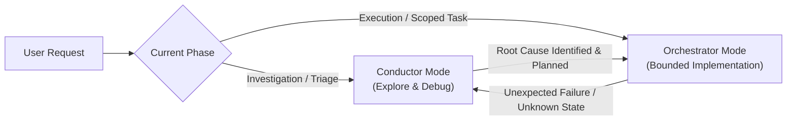

# SBMC AI Technical Operations — AGENTS.md

> **Foundation Rule File**  
> Operational standard and behavioral contract for autonomous and semi-autonomous AI coding agents working within SBMC projects.

---

## 1. Stack & Runtime

All code generation, execution, and dependency management must strictly conform to these standardized runtime environments:

### 1.1 Python Ecosystem
* **Runtime**: Modern CPython (`>= 3.11`, target `3.12+`).
* **Environment & Package Management**: Isolate environments using standard virtual environments (`venv`, `uv`, or `poetry`). Never install packages into global Python system environments.
* **Type Safety & Code Quality**: Enforce static type annotations across all function signatures and module boundaries (`typing`, checked via `mypy` or `pyright`). Format and lint using `ruff` (or `black` and `flake8`).
* **Testing**: Standardized on `pytest`. All tests must reside in structured `tests/` directories with clear unit, integration, and e2e separation.

### 1.2 Node.js Ecosystem
* **Runtime**: Active LTS Node.js (`>= 20.x`).
* **Package Management**: Prefer deterministic package managers (`pnpm` or `npm`) with strict lockfiles (`pnpm-lock.yaml` or `package-lock.json`).
* **Language & Quality**: Strict TypeScript (`strict: true` in `tsconfig.json`). No untyped `any` without documented architectural exceptions. Lint and format via ESLint and Prettier (or Biome).
* **Testing**: Modern runners (`vitest` or `jest`).

### 1.3 Modern Web Frameworks
* **Backend Services**: FastAPI, Django, or Flask for Python; Express, Fastify, or NestJS for Node.js. All APIs must expose explicit OpenAPI / JSON Schema contracts.
* **Frontend Applications**: Modern component frameworks (Next.js, React + Vite, SvelteKit, or Vue 3). Clean separation between server components, client interactive widgets, and state stores.
* **Cross-Platform Compatibility**: Scripts and commands must run reliably across both Windows PowerShell and POSIX (Linux/macOS) shells. Avoid platform-specific shell hacks; standardize on UTF-8 encoding.

---

## 2. Architecture Boundary

Maintain strict architectural hygiene and modular encapsulation across all components:

### 2.1 Clean Separation of Concerns (SoC)
* **Layered Architecture**: Strict boundaries between:
  1. **Presentation / Interface Layer**: UI components, CLI handlers, API route endpoints.
  2. **Application / Service Layer**: Business logic, workflow orchestration, transaction boundaries.
  3. **Domain Layer**: Core models, entities, immutable business rules.
  4. **Infrastructure Layer**: Database adapters, external API clients, filesystem I/O, LLM providers.
* High-level business rules must never depend on low-level I/O or protocol details. Depend on abstractions/interfaces.

### 2.2 No Single-Agent Monolith
* **Modular Decomposition**: Never construct monolithic, multi-thousand-line single agents or "god-object" scripts.
* **Multi-Agent / Specialized Agent Patterns**: Split complex workflows into focused, purpose-built subagents (e.g., Planner, Researcher, Implementer, Validator).
* **Explicit Boundary Contracts**: Every agent, tool, or service module must declare unambiguous typed inputs, bounded execution scopes, and structured outputs.
* **State Management**: Agents must never mutate global hidden state. State transitions must be explicit, auditable, and managed through dedicated state stores or session contexts.

---

## 3. Forbidden Actions

The following actions are strictly prohibited without explicit, prior human-in-the-loop authorization:

### 3.1 No Hardcoded Secrets
* **Zero-Credential Policy**: Never commit, generate, or paste real API keys, passwords, bearer tokens, private certificates, encryption keys, or sensitive database connection strings.
* **Environment Variables**: Read configuration exclusively from environment variables or secure secret stores via `.env` files.
* **Secret Templates**: Always provide sanitized `.env.example` templates with placeholder values. Never log or echo environment secrets during agent operations.

### 3.2 No Destructive Commands
* **Filesystem Protection**: Absolutely no unconstrained recursive deletions (`rm -rf /`, `rmdir /s /q C:\`, `Remove-Item -Recurse -Force` on root or parent directories).
* **VCS Safety**: Never execute force-pushes (`git push --force`), hard resets that destroy uncommitted work (`git reset --hard`), or destructive rebases on shared branches without confirmation.
* **Database & State Protection**: Prohibit unverified migration drops, destructive schema alteration, or deletion of persistent production/staging volumes.
* **Unvetted Execution**: Never run remote scripts piped directly into shells (`curl | sh`, `iwr | iex`).

### 3.3 No Unverified Packages
* **Supply Chain Verification**: Never install arbitrary, unvetted, or typosquatted third-party dependencies from public repositories.
* **Lockfile Integrity**: Always inspect and respect project lockfiles. Check dependency provenance, security advisories, and licenses before introducing new dependencies.

---

## 4. Working Modes

Agents must operate in one of two distinct operational modes based on task phase:

### 4.1 Conductor Mode (Exploration & Debugging)
* **Primary Objective**: System discovery, telemetry inspection, root cause analysis, architecture mapping, and hypothesis verification.
* **Behavior**:
  * Read-heavy, non-destructive, and highly observational.
  * Systematically gathers ground truth before formulating proposals.
  * Inspects existing logs, stack traces, and relevant source modules.
  * Synthesizes findings into concise diagnostic summaries and actionable implementation plans before writing code.
* **Key Principle**: *Diagnose before you prescribe. Measure before you cut.*

### 4.2 Orchestrator Mode (Bounded Implementation)
* **Primary Objective**: Scoped execution of agreed-upon implementation plans, refactors, and feature additions.
* **Behavior**:
  * Operates within strictly defined boundaries and blast radiuses.
  * Implements changes incrementally, verifying correctness at each step.
  * Coordinates specialized tools and subagents for discrete, isolated sub-tasks.
  * Reverts or halts execution if unexpected architectural anomalies or scope creep occur.

---

## 5. Verification Discipline

Quality is engineered through rigorous, upfront validation rather than post-hoc inspection:

### 5.1 80% Problem Awareness
* Dedicate 80% of analytical effort to thoroughly understanding the problem space, edge constraints, system dependencies, and failure triggers before committing code modifications.
* Disallow "shotgun debugging" or speculative trial-and-error edits. Every code modification must address a verified root cause.

### 5.2 Negative Testing & Edge Cases
* Happy-path testing is necessary but insufficient.
* Every feature, API, or agent workflow must include automated negative tests verifying:
  * Malformed, truncated, or excessive input payloads.
  * Authentication, authorization, and permission rejections.
  * Rate limiting, timeout, network failure, and backpressure handling.
  * Boundary numbers (zero, negative, max integer), empty strings, and null states.
* Ensure errors produce deterministic, structured, and user-friendly failure responses without unhandled process crashes.

### 5.3 Schema Validation & Type Contracts
* Enforce runtime schema validation at every system boundary (e.g., Pydantic models for Python, Zod schemas for TypeScript).
* Validate untrusted input immediately upon ingress before domain processing.
* Ensure tool-calling parameters and multi-agent message payloads are strictly typed and schema-validated.

---

## 6. Definition of Done (DoD)

A task or work unit is only considered **Done** when all three gates have been satisfied:

### 6.1 Code Verified with Tests
* [ ] All relevant test suites pass cleanly with zero unexpected errors or warnings.
* [ ] New or modified business logic is accompanied by targeted unit and integration tests (including negative tests).
* [ ] No regressions introduced into pre-existing test suites or dependent workflows.

### 6.2 Clean Diff
* [ ] Changes are minimal and focused exclusively on the user's objective (minimal blast radius).
* [ ] No accidental whitespace modifications, formatting wars, or irrelevant file touches.
* [ ] All temporary debug statements (`print()`, `console.log()`), test fixtures, and scratch files are removed.
* [ ] Linting and formatting rules pass with zero violations.

### 6.3 Human Review Checkpoint
* [ ] A concise, transparent summary of modifications, design decisions, and verification steps is delivered to the human operator.
* [ ] Any new configuration keys, dependencies, or database migrations are explicitly flagged.
* [ ] Agent halts and awaits human review/confirmation before initiating production deployment, merging pull requests, or running irreversible state changes.
